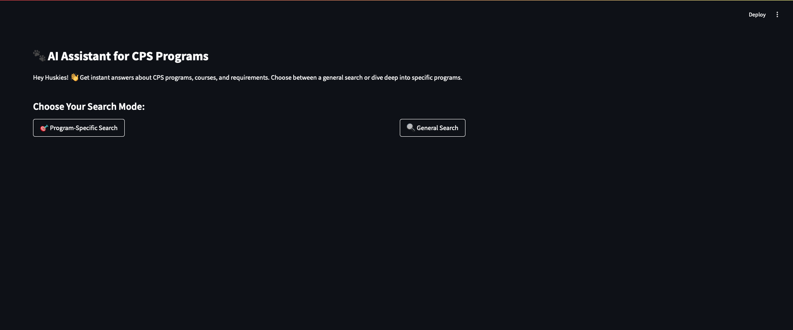
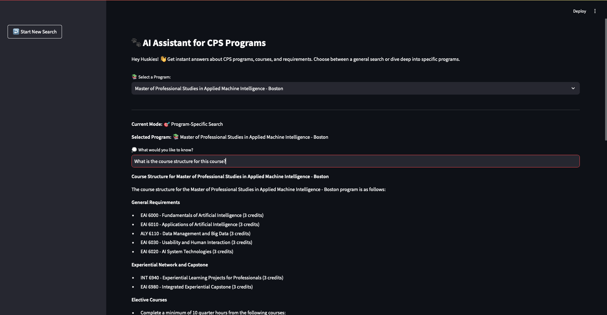
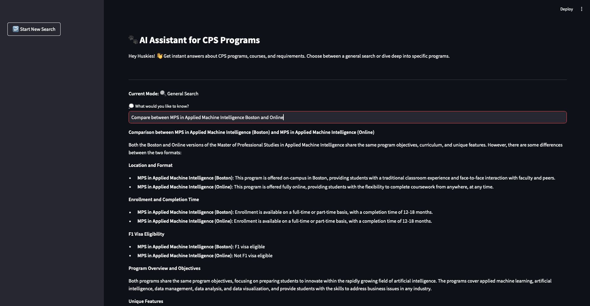

# CPS AI Assistant

## Overview
The **CPS AI Assistant** is an open-source AI-powered assistant designed to reduce the workload for academic advisors by providing instant responses to student queries. It is built using Retrieval-Augmented Generation (RAG) and leverages vector databases for efficient information retrieval.

## Features
- **RAG-based Information Retrieval**
- **Vector Database Storage** using Supabase
- **Local Embedding Model** using Ollama
- **Streamlit UI** for easy interaction
- **Automated Data Scraping & Cleaning**
- **Fast and Scalable Deployment**

## Technologies Used
- **Python 3.9+**
- **Ollama** (for text embeddings)
- **Supabase** (as the vector database)
- **Groq API** (for AI model inference)
- **Streamlit** (for the UI)
- **Crawl4AI** (for web scraping)
- **LangChain** (for RAG implementation)


## Project Snapshots
Here are some snapshots of the project in action:

### Homepage


### Program-Specific Search


### General Search


# CPS AI Assistant Setup Guide

## Prerequisites

Ensure you have the following before starting the setup:
- A machine with **Python 3.9 or greater** installed.
- **Git** installed to clone the repository (or download the ZIP manually).

## Step 1: Clone the Repository

1. Open a terminal and run the following command to clone the repo:
   ```bash
   git clone https://github.com/jibinb961/cps_assistant_rag.git
   ```
   OR manually download the ZIP from the GitHub link and extract it.
2. Navigate to the project folder:
   ```bash
   cd cps_assistant_rag
   ```

## Step 2: Set Up a Virtual Environment

1. Run the following command to create a virtual environment:
   ```bash
   python3 -m venv venv
   ```
2. Activate the virtual environment:
   - On macOS/Linux:
     ```bash
     source venv/bin/activate
     ```
   - On Windows (Command Prompt):
     ```cmd
     venv\Scripts\activate
     ```
   - On Windows (PowerShell):
     ```powershell
     .\venv\Scripts\Activate.ps1
     ```
3. Install the required dependencies:
   ```bash
   pip install -r requirements.txt
   ```

## Step 3: Set Up the `.env` File

1. Navigate to the `cps_assistant_rag` folder and open it in a code editor.
2. Create a new file named `.env` under `/dev` location in the project root directory.
3. Add the following environment variables:
   ```env
   GROQ_API_KEY=your_actual_api_key_here
   SUPABASE_URL=your_service_url
   SUPABASE_SERVICE_KEY=your_Supabase_apikey
   ```

### Configure Supabase

1. Go to [Supabase](https://supabase.com) and create a new account.
2. Navigate to the **SQL Editor** and create a new table.
3. Copy the SQL script from `sql_script/Sql_functions.sql` and execute it.
4. From the **Project Settings**, copy the **Service URL** and **API Key**, and add them to the `.env` file.

### Configure Groq

1. Go to [Groq](https://groq.com) and create a new account.
2. Navigate to the **API Keys** section and generate a new API Key.
3. Copy the API Key and add it to the `.env` file under `GROQ_API_KEY`.

Save the `.env` file once all values are added.

## Step 4: Set Up Ollama Locally (Text Embedding Model)

1. Go to [Ollama](https://ollama.com) and create a new account.
2. Download and install Ollama on your local system.
3. Open a new terminal and run the following command to install and start the embedding model:
   ```bash
   ollama run nomic-embed-text
   ```
   This will start an endpoint at `localhost` to serve as the embedding model.

## Step 5: Store Information in the Vector Database

1. Configure the `upload_to_vectordb.py` file according to your needs. Some cleaning functions are specific to my college website, so modify them to fit your scraped data.
2. Ensure Ollama is running.
3. Run the `upload_to_vectordb.py` script:
   ```bash
   python upload_to_vectordb.py
   ```
   This will scrape, clean, split the data into chunks, generate vector embeddings, and push the chunks to the Supabase vector database. The process duration will depend on your machine specifications and the size of the scraped data.

## Step 6: Run the Streamlit UI

1. Navigate to the `dev` folder under `cps_assistant_rag`:
   ```bash
   cd dev
   ```
2. Start the Streamlit application:
   ```bash
   streamlit run rag.py
   ```
3. The application will open in your default browser at:
   ```
   http://localhost:8501
   ```
   **Note:** `http://localhost:8501` is the default address provided by Streamlit.

## Troubleshooting

- If you encounter any issues with missing dependencies, try running:
  ```bash
  pip install -r requirements.txt --upgrade
  ```
- If the Streamlit app doesn't start, verify that your virtual environment is activated before running the command.

---


## How It Works
1. **Data Collection**: The assistant scrapes relevant college data and preprocesses it.
2. **Vectorization**: Data is split into chunks, embedded using Ollama, and stored in Supabase.
3. **Query Processing**: User queries are processed via the RAG model, retrieving relevant chunks and generating responses.
4. **AI Response**: The AI model (via Groq API) refines and presents the final answer.

## Contributing
Feel free to fork the repository and submit pull requests with improvements.

## License
This project is licensed under the MIT License.

## Contact
For any issues, check the [GitHub Issues](https://github.com/jibinb961/cps_assistant_rag/issues) section.


